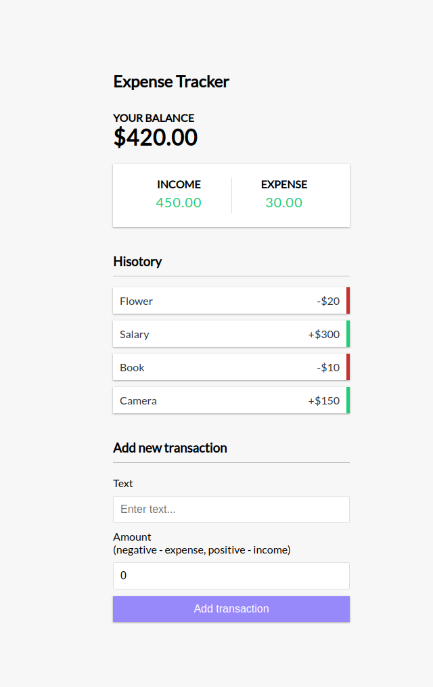

## Intro.

Dummy hook code following the tutorial https://www.youtube.com/watch?v=XuFDcZABiDQ https://github.com/bradtraversy/expense-tracker-react

---

This project was bootstrapped with [Create React App](https://github.com/facebook/create-react-app).

## Available Scripts

In the project directory, you can run:

### `yarn start`

Runs the app in the development mode. 
Open [http://localhost:3000](http://localhost:3000) to view it in the browser.

The page will reload if you make edits. 
You will also see any lint errors in the console.
